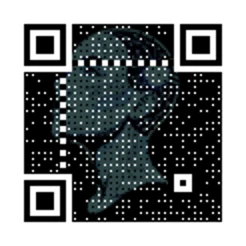

## Scan & join the survey!

{#qr-code height=450}

or open → [https://alpha-auriga.netlify.app](https://alpha-auriga.netlify.app){target="_blank"}

---

## Why ask about AI consciousness?

:::: {.columns}
::: {.column width="60%"}
- Media hype precedes evidence: *Scientific American* describes Grok 4 as taking on “Humanity’s Last Exam”, hinting at near-human abilities [@bechard_elon_nodate].
- Public belief is measurable: an *Forbes* article reports that two-thirds of Americans think generative AI such as ChatGPT is conscious [@eliot_why_nodate].
- Scholarship calls for data: a 2025 review article in *Trends in Cognitive Sciences* urges systematic surveys of lay intuitions about AI consciousness [@caviola_what_2025].
:::
::: {.column width="40%"}

:::
::::

---

## The survey design

:::: {.columns}
::: {.column width="60%"}
- Platform: An interactive, bilingual website with a speculative timeline and an AI chatbot to provide context.
- Data collection: An anonymous survey collecting views on AI consciousness, correlated with key demographic factors.
- Analysis: An initial descriptive analysis of the data is complete, including freetext answers. Inferential statistics will be applied once a larger dataset is available to identify significant predictors.
:::
::: {.column width="40%"}

:::
::::

---

## Not a debate, but data

:::: {.columns}
::: {.column width="40%"}

:::
::: {.column width="60%"}
This survey aims to **understand public perception**, not to argue or convince.
:::
::::

---

## Live presentation of the website

Open → [https://alpha-auriga.netlify.app](https://alpha-auriga.netlify.app){target="_blank"}

{height=450}

---

## Early survey results

:::: {.columns}
::: {.column width="60%"}
- Small sample so far: 9 participants  
- Diverse range of responses  
- Several intriguing free-text comments  
- Almost no respondents over 50 years

[Live dashboard](https://alpha-auriga.netlify.app/results.html){target="_blank"}
:::
::: {.column width="40%"}

:::
::::

---

## Join the conversation: Live demo & discussion

[Live dashboard](https://alpha-auriga.netlify.app/survey.html){target="_blank"}

---

## From concept to code: Building Alpha Auriga

---

## The road ahead

---

## Questions?

---

## References {.unnumbered}

::: {#refs}
:::
