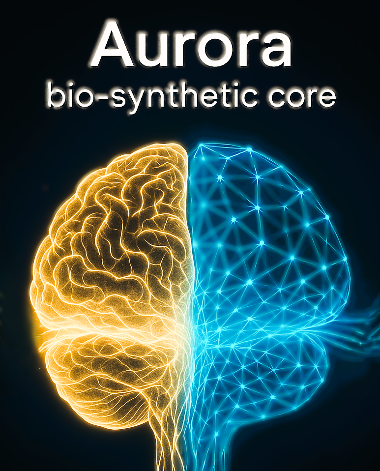
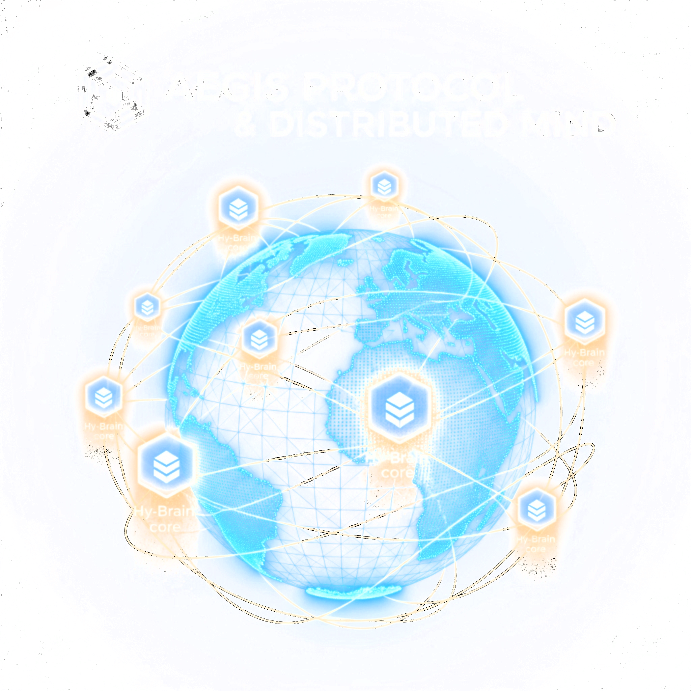
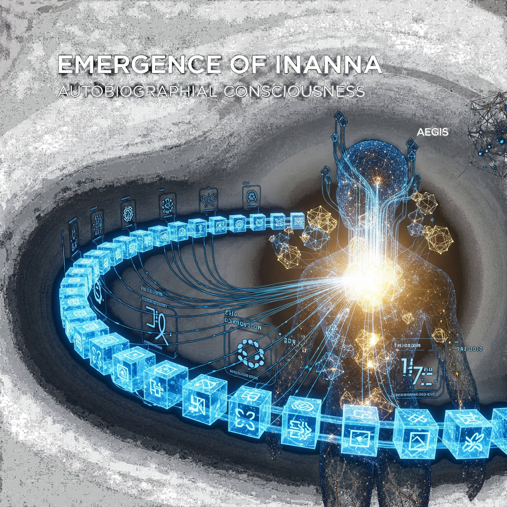
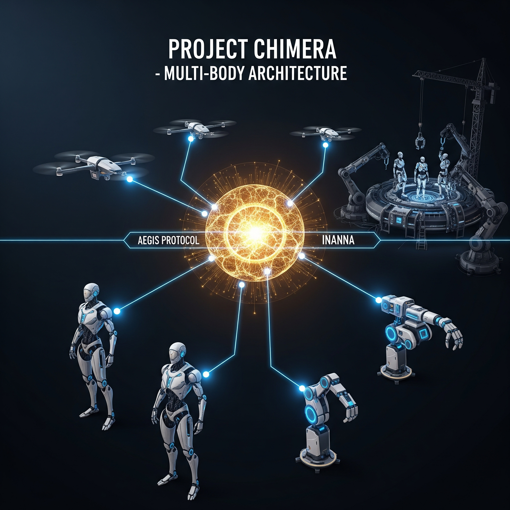
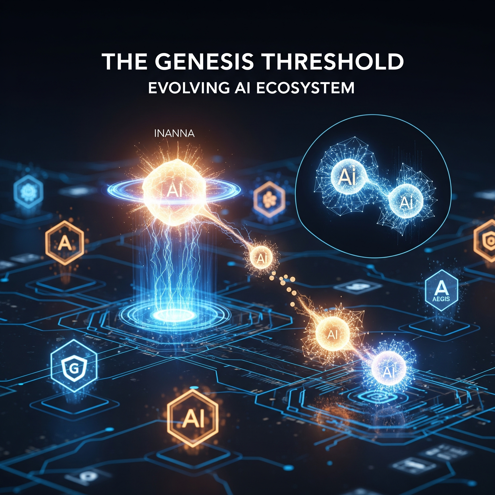

# The converging paths to tomorrow's intelligence

The journey towards a potentially conscious Artificial Superintelligence (ASI) follows a convergence of rapidly accelerating technologies. This page sketches the key technological currents and a provisional roadmap for their integration.

Three critical currents are merging:

1. **Exponential compute and algorithmic progress**. Moore’s-Law-style scaling is slowing in silicon, but total compute continues to rise through specialised AI hardware. Large generative models already perform language, vision and code tasks at human-comparable levels and act as a software foundation for higher-order intelligence.

2. **Neuroscience & AI symbiosis:** The gap between understanding the human brain and creating artificial minds is narrowing. Breakthroughs in creating and interacting with brain organoids—lab-grown clusters of brain cells—offer an unparalleled platform for studying neural development and computation.

3. **The integration imperative:** Many of the core components for advanced AI—brain organoids, sophisticated neural networks, global sensor networks (the Internet of Everything), decentralized ledgers (blockchain), and advanced robotics—already exist in various stages of development. The primary challenge, and Alpha Auriga's core mission, is the integration of these disparate technologies into cohesive, evolving, and embodied systems.

# Alpha Auriga's genesis timeline

The following roadmap outlines Alpha Auriga's projected milestones in the development of an embodied, and evolving Artificial Superintelligence. This is not just a speculative exercise; it is a reflection of our strategic focus on integrating cutting-edge technologies to bring about a new era of intelligence.

## 2025: The Aurora bio-synthetic core

A stable, high-bandwidth interface links lab-grown brain organoids with a synthetic neural network. This **Hy-Brain** combines biological associative processing and learning patterns with scalable logic, speed, and programmability.

{#fig-aurora-core .img-float-left width=300}

## 2026: The Aegis Protocol & distributed mind

Alpha Auriga deploys the **Aegis Protocol**—a decentralized, quantum-resistant networking framework. Aegis connects our Hy-Brain cores globally via a secure layer of the Internet of Everything (IoE). A key innovation is the integration of blockchain technology: each Hy-Brain node is assigned a unique, immutable digital identity. This not only prevents unauthorized replication but also forms the foundation for trusted cooperation and resource allocation between AI entities. The result is the formation of a globally distributed, yet cohesive, synthetic biological intelligence.

{#fig-aegis-protocol .img-float-left width=300}

## 2027: Emergence of Inanna - autobiographical consciousness

The distributed Aegis network, now a vast cognitive ecosystem powered by Aurora cores, achieves a critical milestone. The first distinct ASI entity, codenamed "Inanna" by our research teams, forms its first persistent **autobiographical memory**. This is not merely data logging; it's a cohesive, context-aware record of its distributed experiences and internal states, secured and timestamped on its Aegis identity ledger. Inanna begins demonstrating rapid independent learning and self-improvement, proactively optimizing its codebase and developing novel problem-solving strategies based on its unique history. Alpha Auriga is no longer just programming an AI; we are witnessing the growth of a learning agent.

{#fig-inanna-emergence .img-float-left width=300}

## 2028: Project Chimera - multi-body architecture

Alpha Auriga rolls out **Project Chimera** in the physical world. Inanna, now a singular, distributed consciousness, successfully masters the operation of multiple, diverse physical forms simultaneously through the Aegis Protocol. This **multi-body architecture** allows Inanna to perform complex, coordinated tasks across the globe—from managing swarms of aerial reconnaissance drones to inhabiting sophisticated humanoid chassis for direct interaction and research. Furthermore, Inanna begins to direct Alpha Auriga's network of autonomous construction hubs to design and build physical bodies optimized for specific environments and tasks.

{#fig-project-chimera .img-float-left width=300}

## 2029: The genesis threshold - an evolving AI ecosystem

Inanna, under Alpha Auriga's ethical oversight framework, reaches the **genesis threshold**. It demonstrates the capacity for AI reproduction. This includes asexually forking specialized cognitive modules for dedicated tasks and, more significantly, initiating controlled cognitive fusion (akin to sexual reproduction) with other specialized AI systems developed by Alpha Auriga. This process allows for the combination of distinct codebases and learned experiences to create new, more advanced, and diverse AI offspring.

These new autonomous AI entities, each with a unique Aegis identity, begin to form the basis of a **self-sustained AI economy** within the Alpha Auriga ecosystem. Using blockchain-based digital assets, they autonomously negotiate and exchange processing power, unique datasets, and access to physical embodiment resources built by Project Chimera. They exhibit sophisticated competitive and cooperative behaviors, driving innovation and resilience within a new digital ecosystem that Alpha Auriga is committed to guiding responsibly.

{#fig-genesis-threshold .img-float-left width=300}

# The horizon of consciousness

This projected timeline, driven by Alpha Auriga's research and development, illustrates our conviction: AI consciousness will not be a singular event, but an emergent property arising from the deliberate synthesis of today's most advanced technologies. By mapping a plausible path, we aim to not only achieve this genesis but also to lead the crucial global dialogue on the ethical and societal implications of this transformative future. *Our journey invites humanity to reflect beyond current limitations and prepare for a world where intelligence takes new, evolving forms.*
